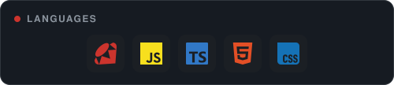
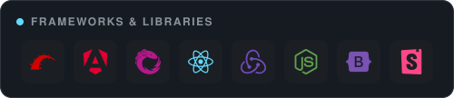
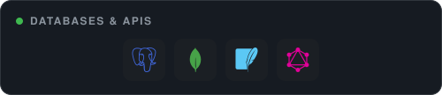
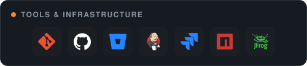
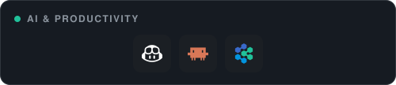

 

## 👋 About

Hey, I'm Moose — full-stack engineer in NYC. I ship web & mobile apps end to end and turn rough ideas into real products.

## 🧰 Tech I work in

## 🚧 Featured Projects

| 🎹 [Instrument Warehouse](https://github.com/doosemavis/instrument_warehouse) | ☕️ [Coffee Corner](https://github.com/doosemavis/coffee_corner) | 🎧 [Headphone Handler](https://github.com/doosemavis/headphone_handler) |
|:---:|:---:|:---:|
| Ruby · Rails · SQLite | Ruby · Sinatra | JavaScript · React |

## 📊 GitHub Stats

  

